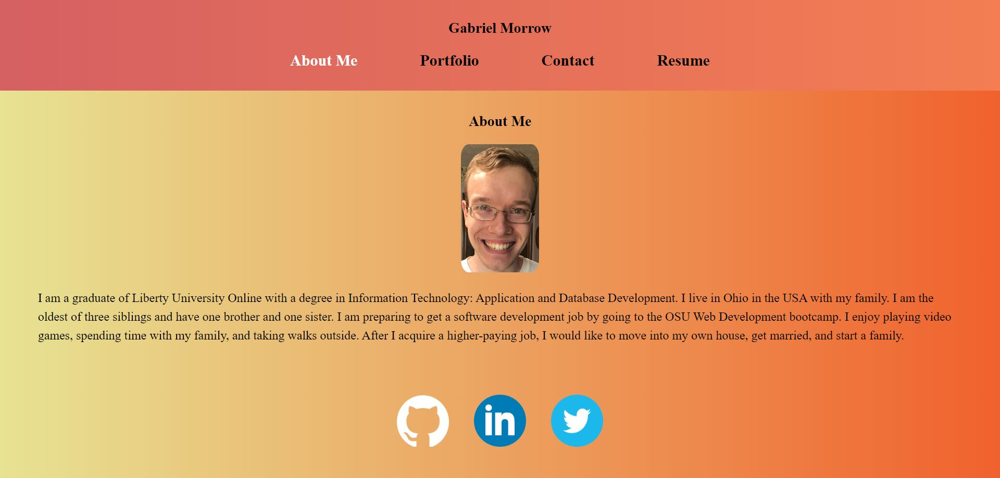

# React Portfolio

## Description

My motivation for building this project was to gain experience with building a single-page application using React.  I wanted to learn React because it is a skill that is currently in demand.  I built this project so that I could showcase my best projects for the software development bootcamp, but also practice using React at the same time.  This project solves the problem of a student needing a place to showcase the projects he or she has created.  It also allows the student to make his or her resume available for download online.
For this project, I learned, how to use React to break a webpage into its various components, and then link them back together.  I also learned how to make a file available for download using HTML.

## Table of Contents (Optional)

This README isn't that long, so N/A

## Installation

N/A

## Usage

This application has been deployed to Netlify.  To use it, please visit the following link: [https://sweet-beignet-dc9e0c.netlify.app/](https://sweet-beignet-dc9e0c.netlify.app/).

Here is a screenshot of the React Portfolio: 

Click the links in the header to visit the different portions of the application.  

The About Me page of the application contains a photo of me and a short length of text about me.  

The Portfolio page contains pictures of six of my bootcamp projects.  Hovering over a project image displays the title of the project, the noteworthy technologies it uses, a link to the deployed application, and a link to the application's GitHub repository.  

The Contact page contains a contact form where the user can enter a name, email address, and message.  If the user clicks into a text field, doesn't enter text, and then clicks outside of that field, an error message is displayed.  Clicking the Submit button on this page doesn't really do anything noteworthy at the moment.  In the future, I may change this so that it sends an email to my email inbox.

The Resume page contains a link to download my resume and a list of front-end and back-end technologies that I am proficient in.

The user can also click on the three icons in the footer to visit my profiles on GitHub, LinkedIn and Twitter/X.

## Credits

I used the Xpert Learning Assistant AI chatbot to help out with writing the code.  I took the code for the Error.jsx page from activity 24 of Module 20.

## License

This project is under an MIT License.  Please see the license in the GitHub repository for more information.

## Badges

I don't have any noteworthy badges to display.

## Features

This project is a portfolio application that displays images from six of my noteworthy projects.  Hovering over each image displays a list of noteworthy technologies in the application, a link to the deployed application, and a link to the application's GitHub repository.  The project also contains a Contact form that displays error messages if the user clicks out of the input fields without entering text.  However, the contact form doesn't actually contact me yet.  Finally the project contains a link to download my resume as well as a list of technologies that I am proficient in.  The footer contains icons which link to my Github, LinkedIn, and Twitter accounts.

## How to Contribute

This was a project I personally completed, so N/A.

## Tests

N/A
